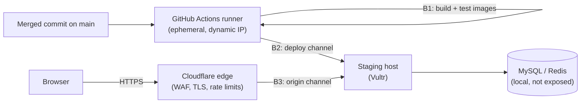

# Threat Model — Deploy Pipeline and Staging Runtime

| | |
|---|---|
| Epics | DEVOPS-02 Deploy pipeline, DEVOPS-01 Environments, SEC-07 Edge protection |
| Method | STRIDE per element of the data-flow diagram |
| Requirements | NFR-011 (layering), NFR-014 (supply chain), OPS-001…004, SEC-003, SEC-004, SEC-007, SEC-012 |
| Standard | OWASP ASVS 5.0 Level 2; **Level 3** for deploy credentials and the runtime secrets the pipeline delivers |
| Status | Baseline, written **before** the pipeline code. Re-review before the first production deploy. |

This model covers how a merged commit becomes a running PaxofiCloud on the
staging host. Production will reuse the same pipeline with a separate GitHub
Environment, separate credentials and a static egress address (see
THREAT-MODEL-VPS-PROVIDERS.md, open item O-3).

---

## 1. Scope

In scope:

- Building the runtime images (PHP-FPM with the application code, Nginx) in GitHub Actions.
- Moving the images and runtime configuration to the host.
- Running migrations, switching traffic and rolling back.
- The host's inbound exposure: HTTP(S) and administrative access.
- Runtime secrets that the pipeline delivers: database, Redis, and the provider-credential KEK for workers.

Out of scope:

- Host provisioning (`infra/staging`, already merged).
- Application-level threats (identity, providers and payments each have their own model).

## 2. Assets

| Asset | Why it matters | Classification |
|---|---|---|
| Deploy credential (whatever lets CI change the host) | Equivalent to root on the host and to everything the application can reach | Restricted (L3) |
| Runtime secrets (DB/Redis passwords, provider-credential KEK) | The KEK decrypts every stored provider token | Restricted (L3) |
| Runtime images | They contain the private PCF framework source and all application code | Confidential, integrity-critical |
| Origin host address | If it is known and reachable, the Cloudflare WAF and rate limits can be bypassed | Internal |
| Database contents | Customer and personal data (NDPA 2023) | Confidential |

## 3. Data flow and trust boundaries

- **B1 runner.** It holds environment secrets only for jobs that the `staging` environment approval has gated.
- **B2 deploy channel.** It is the most sensitive boundary, and this model decides it.
- **B3 origin channel.** Today it is HTTPS on port 443, allow-listed to Cloudflare's published ranges.

## 4. Options for B2/B3 (decided: B)

| | A. Open SSH | B. Cloudflare Tunnel (recommended) | C. Pull from a registry |
|---|---|---|---|
| How CI reaches the host | SSH on port 22, open to the internet (runner IPs are dynamic), key-only, fail2ban | SSH through an outbound-only `cloudflared` tunnel. A Cloudflare Access policy admits only a CI service token. | CI pushes images to GHCR. A timer on the host polls and pulls. |
| Inbound ports on the host | 22 (world) + 443 (Cloudflare) | **None** | 443 (Cloudflare) |
| Web traffic path | Cloudflare → origin 443. Needs an Origin Certificate on the host. | Cloudflare → tunnel. No origin certificate, and the origin IP is useless to an attacker. | as A |
| Where private code goes | Only to the host | Only to the host (`docker save` streamed over the tunnel) | Into a registry (must be private, which uses GitHub Free's package quota) |
| Long-lived secrets on the host | none extra | tunnel token | registry pull token |
| Credential in CI | SSH private key | Access service token (client ID and secret) and an SSH key | registry push (`GITHUB_TOKEN`) |
| Cost | free | free (Cloudflare Zero Trust free plan) | free within quota |
| Main risk | SSH exposed to the whole internet | Extra Cloudflare token scope; tunnel token on the host | Pull token on the host; private code in a registry |

**Recommendation: B.**
- The host exposes no inbound port at all, so the origin can't be scanned or bypassed.
- No Origin Certificate needs creating or rotating.
- Private code never leaves GitHub's runner except to our own host.

The cost is that the existing Cloudflare API token needs three more account-level permissions, listed in §8.

## 5. Design decisions (option B)

| ID | Decision |
|---|---|
| P-1 | Images are built only from a commit on `main`, after the full CI suite passes on that commit. Base images are pinned by digest. Composer runs with `--no-dev`, and its lock is verified. |
| P-2 | Images are labelled with the git SHA. The host keeps the previous image so a rollback is a retag. Nothing is built on the host. |
| P-3 | Deploys run only via `workflow_dispatch` (later: automatically after main is green), in the `staging` environment, which requires approval. Concurrency is 1 and a deploy is never cancelled mid-way. |
| P-4 | CI connects through the tunnel as user `deploy`, which may only run `/usr/local/sbin/paxoficloud-deploy` (forced command). No interactive shell. |
| P-5 | Runtime secrets live as GitHub Environment secrets. They are written on the host to `/etc/paxoficloud/app.env` (root:deploy, mode 0640) and passed to containers through `env_file`. They are never put in images, logs or the repository. |
| P-6 | The KEK (`PROVIDER_CREDENTIAL_*`) goes **only** to the worker container. The web container never receives it (VPS threat model D-5). |
| P-7 | Deploy sequence: load images → `migrate:status` → `migrate` → start the new containers → health check `/health/ready`. If any step fails: automatic rollback to the previous image and a non-zero exit. |
| P-8 | Migrations are forward-only and additive (MIGRATIONS.md), so a rollback of the code never needs a rollback of the schema. |
| P-9 | Containers: non-root, read-only root filesystem, `cap_drop: ALL`, `no-new-privileges`. MySQL and Redis are on an internal Docker network with no published ports. |
| P-10 | The host blocks container access to the cloud metadata address (169.254.169.254) with a `DOCKER-USER` iptables rule, so the tunnel token in user data cannot be read from inside a container. |
| P-11 | Logs print step names and results only: no env files, no `docker inspect`, no IPs. The repository is public, so its Actions logs are public too. |
| P-12 | The Vultr firewall drops all inbound traffic. Break-glass access is the Vultr web console. |

## 6. Threats (STRIDE)

| ID | Threat | Element | Mitigation | Test |
|---|---|---|---|---|
| D-01 | **S**: someone other than CI connects to the deploy channel | B2 | Access policy admits only the service token. sshd allows only `deploy`, by key. The forced command limits what it can run. | Connecting without the token is refused at the Access layer, and this is checked in the pipeline smoke step. |
| D-02 | **T**: a malicious PR changes the workflow to exfiltrate secrets | B1 | Secrets are only in the `staging` environment (approval required, `main` only). PR workflows get no secrets. Actions are pinned. | A PR run shows the deploy job skipped and no secrets in its env. |
| D-03 | **T**: a tampered base image or dependency | B1 | Base images pinned by digest. `composer.lock` and `npm ci` are verified. Dependabot, Dependency Review and CodeQL gate merges. | The build fails if a digest pin is missing (lint step). |
| D-04 | **I**: secrets leak through public logs | B1 | P-11. Values are GitHub-masked. Env files are written with `umask 077` and never printed. | grep of the log for known secret names returns only `***`. |
| D-05 | **I**: the origin IP is discovered and used to bypass Cloudflare | B3 | Option B leaves no inbound port, so the IP is useless (P-12). | An external probe of port 443 or 22 on the origin times out. |
| D-06 | **I**: a container reads cloud metadata and gets the tunnel token | Host | P-10. The app's outbound client also denies link-local addresses. | `curl 169.254.169.254` from the PHP container fails. |
| D-07 | **I**: the web tier is compromised and reads the KEK | Runtime | P-6: the KEK exists only in the worker environment. | `env` in the PHP-FPM container has no `PROVIDER_CREDENTIAL_KEYS`. |
| D-08 | **T**: a half-applied deploy leaves a broken site | Host | P-7 and P-8, with automatic rollback. | A deliberately broken image triggers a rollback, and the old version keeps serving. |
| D-09 | **D**: a failed or partial migration | DB | Advisory lock in the migrator, `migrate:status` gate, forward-only migrations. | The migration integration tests already pass in CI. |
| D-10 | **E**: container escape to the host | Host | P-9, Docker `no-new-privileges`, unattended security upgrades. | `docker inspect` shows a non-root user, read-only filesystem and dropped capabilities (checked by the deploy script). |
| D-11 | **R**: nobody can tell who deployed what | Pipeline | The environment approval records the approver. The image label carries the SHA, and the host keeps a deploy log (SHA, time, result). | The deploy log entry exists after every run. |
| D-12 | **S**: a stolen service token or deploy key | B2 | Both are scoped to staging only, with a 90-day expiry. Rotate on suspicion. Production uses separate credentials. | Expiry date recorded at creation; reviewed as an operations task. |

## 7. Residual risks

- **Cloudflare is a single dependency for both access and serving.** If Cloudflare is down, staging is unreachable. That is acceptable for staging. Production adds a second break-glass path (O-3).
- **The tunnel token sits in the instance user data.** It is readable by root on the host and by anyone with the Vultr API key. This is mitigated by the least-privilege Vultr sub-user and P-10.

## 8. Open items (CEO)

| ID | Item |
|---|---|
| DP-1 | **Decided 2026-10-10 (CEO): option B, Cloudflare Tunnel.** |
| DP-2 | For B: add to the existing Cloudflare API token: **Account → Cloudflare Tunnel: Edit**, **Account → Access: Apps and Policies: Edit**, **Account → Access: Service Tokens: Edit**. Keep the existing zone permissions. |
| DP-3 | Not needed: the Origin Certificate applied only to option A. |
| DP-4 | **Before production:** with `APP_ENV=production`, PCF caches the resolved configuration, including the database password, in `storage/cache/config.php`. Staging runs `APP_ENV=staging` (no cache), and the image filesystem is read-only. For production, either keep the cache on a tmpfs or have PCF exclude secrets from it (PCF change, needs approval). |

## 9. Review log

| Date | Change |
|---|---|
| 2026-10-10 | Baseline written before any pipeline code. |
| 2026-10-10 | DP-1 decided by the CEO: option B (Cloudflare Tunnel). |
| 2026-10-10 | DP-4 added: the production config cache stores resolved secrets on disk. |
