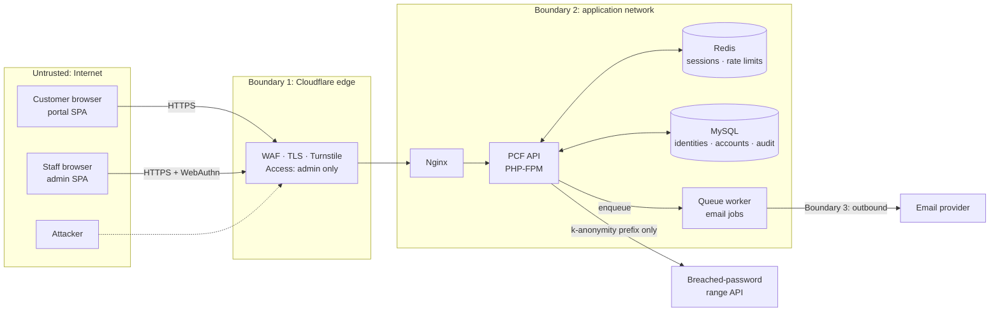

# Threat Model — Identity, Sessions, Tenant Isolation and Audit (Sprint 1)

| | |
|---|---|
| Epic | Identity & access (SEC-01 / SEC-02 / BE-06) |
| Method | STRIDE per element of the data-flow diagram |
| Requirements | IAM-001…016, ACC-001…003, ACC-005, AUD-001…004, API-002…008, SEC-011 |
| Standard | OWASP ASVS 5.0 — Level 2; Level 3 for staff authentication and the admin console |
| Status | Baseline for Sprint 1. Must be re-reviewed at Sprint 1 planning and updated at sprint end. |

This document is written **before** any identity code exists. Every Sprint 1
pull request touching identity must cite the threat IDs (`T-xx`) it mitigates
and add the matching tests listed in §7. A threat is only "mitigated" when its
test exists and passes in CI.

---

## 1. Scope

In scope:

- Customer registration, email verification, sign-in, sign-out.
- Passwords (policy, storage, reset), TOTP MFA and recovery codes.
- Server-side sessions, CSRF, step-up authentication, email change.
- Staff authentication with WebAuthn and staff role-based access control.
- Tenant isolation (identity → account → resources).
- Security audit log and log redaction.
- Edge controls that protect these flows: rate limiting, bot protection,
  security headers, CORS.

Out of scope (own threat models later): payments and webhooks (Sprint 3),
provider credentials (Sprint 3), provisioning (Sprint 4), the admin console's
business functions (Sprint 9).

## 2. Assets

| Asset | Why it matters | Classification |
|---|---|---|
| Customer credentials (password hash, TOTP secret, recovery codes) | Account takeover → domains, servers, money | Restricted |
| Session identifiers and CSRF tokens | Bearer access to an account | Restricted |
| One-time tokens (verify, reset, email-change, staff invite) | Bearer access to a specific action | Restricted |
| Staff WebAuthn credentials and staff sessions | Access to every customer | Restricted (L3) |
| Identity PII (name, email, phone, IP history) | NDPA 2023 personal data | Confidential |
| Account ownership (identity ↔ account ↔ resources) | Basis of tenant isolation | Integrity-critical |
| Audit log | Evidence for disputes, fraud and incident response | Integrity-critical |
| Encryption keys (TOTP secret key, audit/HMAC keys) | Protect the assets above | Restricted; environment secrets only |

## 3. Data-flow diagram and trust boundaries

Trust boundaries:

1. **Internet → edge.** Everything from a browser is untrusted, including the
   frontend SPAs, which are public code.
2. **Edge → application.** Origin accepts traffic only from Cloudflare (origin
   firewall and authenticated origin pulls). The API never trusts client IP
   headers other than `CF-Connecting-IP`, and only on that path.
3. **Application → third parties.** Outbound calls go only to allow-listed
   hosts with timeouts and size caps, and never carry secrets beyond what the
   call needs.

## 4. Assumptions

- PHP 8.4+, libsodium and `password_hash` are trustworthy; we never implement
  cryptographic primitives ourselves (company rule).
- Cloudflare terminates TLS in Full (strict) mode; the origin certificate is
  valid (SEC-007).
- Redis and MySQL are reachable only from the application network, require
  authentication, and are not exposed publicly (SEC-013).
- The email channel is the customer's recovery root. Its compromise is a
  residual risk (R-1) reduced by MFA, not eliminated.
- At MVP one identity owns exactly one account (ACC-001); team membership is
  Phase 2 but the authorizer already checks membership, so the model will not
  change.

## 5. Design decisions this model fixes

These are binding for Sprint 1 implementation. Changing one requires updating
this document in the same PR.

| ID | Decision |
|---|---|
| D-1 | **Random values:** every token, session ID and recovery code comes from `random_bytes()` with ≥ 256 bits of entropy (recovery codes: ≥ 80 bits, human-readable). |
| D-2 | **Token storage:** one-time tokens and session IDs are stored only as `SHA-256(token)`; lookup is by hash; the raw value exists only in the email or cookie. A leaked database or Redis dump therefore yields no usable tokens. |
| D-3 | **Passwords:** `password_hash($p, PASSWORD_ARGON2ID, ['memory_cost' => 65536, 'time_cost' => 3, 'threads' => 1])`, `password_needs_rehash` on every successful sign-in. The algorithm is set explicitly; framework defaults are never relied on. |
| D-4 | **TOTP secrets:** 160-bit secrets, encrypted at rest with `sodium_crypto_aead_xchacha20poly1305_ietf_encrypt`, key from environment, ciphertext carries a key ID for rotation, the identity ID is bound as associated data. TOTP verification implements RFC 6238 (HMAC-SHA1, 30 s step, ±1 step) with `hash_equals`, and stores the last accepted time-step to block replay. Unit tests use the RFC 6238 test vectors. |
| D-5 | **Recovery codes:** 10 codes, stored as keyed hashes (`sodium_crypto_generichash` with a server key), single-use, regenerating them invalidates the old set. |
| D-6 | **Sessions:** server-side in Redis under key `sess:{SHA-256(sid)}`; cookie `__Host-pc_sid` (Secure, HttpOnly, SameSite=Lax, Path=/). Staff use a separate cookie `__Host-pc_staff`, a separate Redis prefix and a separate origin; a customer session is never accepted on admin routes and vice versa. Session ID rotates on sign-in, MFA completion, step-up, password change and role change. |
| D-7 | **Uniform responses:** registration, sign-in and password reset return the same response and comparable timing whether or not the email exists. Sign-in for an unknown email runs `password_verify` against a fixed dummy Argon2id hash. |
| D-8 | **Password reset does not bypass MFA.** After a reset the customer must still pass TOTP (or use a recovery code) to sign in. Reset revokes all sessions. |
| D-9 | **No SMS for authentication.** Phone numbers are for contact only, which removes SIM-swap as an attack path. |
| D-10 | **WebAuthn verification uses a vetted, minimal open-source library**, not our own CBOR/COSE/attestation parsing (company rule against rolling our own crypto; a library is not a framework). Required settings: `userVerification=required`, RP ID pinned to the admin origin, sign-count checks, ES256 and EdDSA only. **Library choice is an ADR in Sprint 0** (open item O-1). |
| D-11 | **Staff onboarding:** staff accounts are created only by invitation from a Super Admin. The invite is a single-use 24-hour link that leads directly to WebAuthn enrolment. Every staff member registers at least two authenticators. No self-signup, no password fallback. |
| D-12 | **No impersonation at MVP.** Support staff never "log in as" a customer; they act through audited admin endpoints. |
| D-13 | **Authorization order:** authenticate → load session → resolve the account from the session (never from the request) → `AuthoritativeTenantAuthorizer::assertCanAccess` → load the resource **scoped by account ID in the query** → act. A resource owned by another account returns **404**, not 403, so existence is not revealed. |
| D-14 | **Audit log:** append-only table; the application DB user has `INSERT, SELECT` only; each row stores `hash = SHA-256(prev_hash ‖ canonical_json(event))`. The current chain head is exported daily to storage outside the database (open item O-2) so a database administrator cannot silently rewrite the chain. |

## 6. Threats (STRIDE)

Ratings: **L** likelihood and **I** impact on a 1–3 scale; risk = L × I.
"Test" names the CI test that proves the mitigation (§7).

### 6.1 Registration and email verification (IAM-001, IAM-002, IAM-016)

| ID | STRIDE | Threat | L | I | Mitigation | Req | Test |
|---|---|---|---|---|---|---|---|
| T-01 | I | Account enumeration: "email already registered" reveals customers | 3 | 2 | D-7: always "check your email"; an existing address receives a "someone tried to register" email instead | IAM-001 | `RegistrationEnumerationTest` |
| T-02 | D | Bot mass-registration exhausting email quota or polluting data | 3 | 2 | Turnstile verified server-side (fail closed), per-IP limit 5/h, email sending via queue with a global cap | IAM-016, API-004 | `RegistrationRateLimitTest` |
| T-03 | S | Verification token guessed or reused | 1 | 2 | D-1, D-2; single-use, 24 h expiry; a new token invalidates older ones | IAM-002 | `EmailVerificationTokenTest` |
| T-04 | T | Mass assignment, e.g. `{"role":"admin","account_id":…}` in the body | 2 | 3 | Strict input schema that rejects unknown fields; role and account are never accepted from the client | API-002 | `RegistrationSchemaTest` |
| T-05 | I | Unverified identity places orders or receives services | 2 | 2 | `verified_at` is checked on checkout; unverified identities have read-only scope | IAM-002 | `UnverifiedCannotOrderTest` |

### 6.2 Sign-in and passwords (IAM-003…006)

| ID | STRIDE | Threat | L | I | Mitigation | Req | Test |
|---|---|---|---|---|---|---|---|
| T-06 | S | Credential stuffing with breached passwords | 3 | 3 | Breached-password check at registration and password change (k-anonymity range API: only a 5-character SHA-1 prefix leaves our network; on API outage the check fails open, is logged and is retried at next sign-in); per-account and per-IP throttling; Turnstile after 3 failures; MFA | IAM-003, IAM-006, IAM-016 | `BreachedPasswordTest`, `SignInThrottleTest` |
| T-07 | S | Online brute force against one account, including from many IPs | 2 | 3 | Two counters in Redis: (a) per (account, client-IP bucket): 5 failures → exponential delay up to 15 min; (b) per account across all IPs: above 10 failures/hour every further attempt requires Turnstile and the owner is notified. 30/min per IP overall. MFA makes a guessed password insufficient. Events audited | IAM-006 | `SignInThrottleTest`, `DistributedBruteForceTest` |
| T-08 | D | Attacker locks a victim out by failing on purpose | 2 | 2 | No permanent lockout. Delays from counter (a) apply only to the attacker's IP bucket, so the owner's network is unaffected; counter (b) adds a Turnstile challenge, which the owner can pass, instead of blocking. Successful sign-in resets (a) for that bucket | IAM-006 | `TargetedLockoutTest` |
| T-09 | I | Timing difference reveals whether an email exists | 2 | 2 | D-7 dummy hash; identical code path and response | IAM-005 | `SignInTimingParityTest` (statistical, tolerance-based) |
| T-10 | I | Database leak exposes passwords | 1 | 3 | D-3 Argon2id with explicit parameters; rehash on sign-in | IAM-004 | `PasswordHashingTest` |
| T-11 | D | CPU/memory exhaustion: many concurrent Argon2id verifications | 2 | 2 | Rate limit before hashing; FPM worker cap sized for 64 MiB per hash; sign-in endpoint has its own worker pool limit | IAM-004, API-004 | load test in Sprint 11 |
| T-12 | T | Open redirect via `?next=` after sign-in | 2 | 2 | Only relative paths matching the portal route allowlist; anything else redirects to the dashboard | API-002 | `PostLoginRedirectTest` |

### 6.3 MFA and recovery (IAM-007, IAM-013)

| ID | STRIDE | Threat | L | I | Mitigation | Req | Test |
|---|---|---|---|---|---|---|---|
| T-13 | S | TOTP code replayed within its window | 2 | 2 | D-4 last-accepted step stored; reuse rejected | IAM-007 | `TotpReplayTest` |
| T-14 | S | TOTP brute force (10⁶ space) | 2 | 3 | 5 wrong codes → MFA step locked for 15 min and owner notified; the half-authenticated state lives max 5 min | IAM-007 | `TotpThrottleTest` |
| T-15 | I | TOTP secrets readable from a DB backup | 1 | 3 | D-4 encryption with a key outside the database | IAM-007 | `TotpSecretEncryptionTest` |
| T-16 | S | Social-engineering support to remove MFA | 2 | 3 | No recovery code → support-verified identity check **and** 24 h delay with email notice to the account, cancellable by the owner; staff action audited | IAM-013 | `MfaRecoveryDelayTest` |
| T-17 | E | Enrolling MFA without proving the current password | 2 | 2 | MFA enrol/disable/regenerate are step-up actions (T-22) | IAM-014 | `StepUpRequiredTest` |

### 6.4 Sessions and CSRF (IAM-009…011, API-003)

| ID | STRIDE | Threat | L | I | Mitigation | Req | Test |
|---|---|---|---|---|---|---|---|
| T-18 | S | Session fixation | 2 | 3 | D-6 rotation on every privilege change; a pre-auth session ID is never promoted | IAM-009 | `SessionFixationTest` |
| T-19 | I | Session theft via XSS | 2 | 3 | HttpOnly cookie; strict CSP without `unsafe-inline`; React output encoding, `dangerouslySetInnerHTML` forbidden by lint | API-005, SEC-011 | `SecurityHeadersTest`, frontend lint rule |
| T-20 | I | Session theft from a Redis snapshot | 1 | 3 | D-2/D-6 keys are hashes of the session ID; Redis on private network with ACL user and password | IAM-009, SEC-013 | `SessionStorageHashTest` |
| T-21 | T | Cross-site request forgery | 2 | 3 | Synchroniser token bound to session for every state-changing request **and** `Origin` must match an allowed origin; SameSite=Lax as defence in depth | API-003 | `CsrfTest` |
| T-22 | E | Stolen-but-idle session used for high-impact actions | 2 | 3 | Step-up within 5 min for: change email/password/MFA, domain transfer-out/EPP, VPS rebuild/delete, remove payment method | IAM-014 | `StepUpRequiredTest` |
| T-23 | R | Customer cannot tell a session was hijacked | 2 | 2 | Session list with device/IP/last seen; revoke one or all; new-device sign-in email | IAM-011 | `SessionRevocationTest` |
| T-24 | S | Sessions live forever | 2 | 2 | Idle 30 min / absolute 12 h (customer); 15 min / 8 h (staff); enforced server-side | IAM-010 | `SessionTimeoutTest` |

### 6.5 Password reset and email change (IAM-012, IAM-015)

| ID | STRIDE | Threat | L | I | Mitigation | Req | Test |
|---|---|---|---|---|---|---|---|
| T-25 | S | Reset token theft (referer leak, logs, email scanners) | 2 | 3 | D-2; 30 min, single-use; reset page sets `Referrer-Policy: no-referrer`; the token is consumed by POST, not by GET (link scanners only GET) | IAM-012 | `PasswordResetTokenTest` |
| T-26 | S | Host-header poisoning makes the reset link point to an attacker domain | 2 | 3 | Links are built from a configured base URL, never from the request `Host` | IAM-012 | `ResetLinkBaseUrlTest` |
| T-27 | E | Reset used to bypass MFA | 2 | 3 | D-8 | IAM-012 | `ResetDoesNotBypassMfaTest` |
| T-28 | S | Account takeover by changing email from a hijacked session | 2 | 3 | Step-up; confirm new address; notify old address with a 48 h revert link that also revokes sessions | IAM-015 | `EmailChangeTest` |

### 6.6 Staff authentication and RBAC (IAM-008, ACC-005)

| ID | STRIDE | Threat | L | I | Mitigation | Req | Test |
|---|---|---|---|---|---|---|---|
| T-29 | S | Phishing of staff credentials | 2 | 3 | WebAuthn only (origin-bound, phishing-resistant); admin origin also behind Cloudflare Access | IAM-008 | `StaffWebAuthnOnlyTest` |
| T-30 | S | Cloned authenticator | 1 | 3 | Sign-count regression rejects and alerts; attestation policy recorded per credential | IAM-008 | `WebAuthnSignCountTest` |
| T-31 | E | Customer session reaches admin API | 2 | 3 | D-6 separate cookie, origin and Redis prefix; admin routes require a staff session | ACC-005 | `CustomerSessionRejectedOnAdminTest` |
| T-32 | E | Staff exceeds role (e.g. support issues refunds) | 2 | 3 | Deny-by-default permission map; every admin route declares its permission; CI fails if a route has none | ACC-005 | `AdminRoutePermissionCoverageTest` |
| T-33 | E | Break-glass Super Admin abused | 1 | 3 | Super Admin credentials kept offline; every use alerts the CEO and is audited; no routine work under it | ACC-005 | runbook check (Sprint 11) |
| T-34 | R | Staff denies an action | 2 | 2 | Every staff action audited with staff ID, permission used and correlation ID (D-14) | AUD-001 | `StaffActionAuditedTest` |

### 6.7 Tenant isolation (ACC-001…003)

| ID | STRIDE | Threat | L | I | Mitigation | Req | Test |
|---|---|---|---|---|---|---|---|
| T-35 | E | IDOR: customer changes an ID in the URL/body to reach another account's invoice, domain or server | 3 | 3 | D-13: account from session only; `AuthoritativeTenantAuthorizer`; repository queries always include `account_id`; 404 on mismatch | ACC-002 | **Generated per route** (`TenantIsolationRouteTest`) |
| T-36 | E | A new route ships without an isolation test | 2 | 3 | CI enumerates the route table and fails if any tenant-scoped route lacks a negative test | ACC-003 | `TenantIsolationCoverageTest` |
| T-37 | I | Response reveals that another account's resource exists (403 vs 404) | 2 | 1 | Uniform 404 | ACC-002 | `TenantIsolationRouteTest` |
| T-38 | E | Background job runs in the wrong tenant | 2 | 3 | Jobs carry account ID and re-authorize on execution; no ambient tenant state (PCF: no hidden global state) | ACC-002 | `JobTenantContextTest` (Sprint 4) |

### 6.8 Audit and logging (AUD-001…004, API-008)

| ID | STRIDE | Threat | L | I | Mitigation | Req | Test |
|---|---|---|---|---|---|---|---|
| T-39 | T | Attacker or insider edits or deletes audit rows | 1 | 3 | D-14 grants + hash chain + daily external anchor; chain verification job alerts on break | AUD-002 | `AuditChainVerificationTest`, `AuditGrantsTest` |
| T-40 | I | Secrets in logs (passwords, tokens, session IDs, TOTP secrets) | 2 | 3 | Central redaction by field name and value pattern before any log/audit write; request bodies of auth endpoints are never logged | AUD-004 | `LogRedactionTest` |
| T-41 | T | Log injection via crafted user-agent or name | 2 | 1 | Structured JSON logging only; no string concatenation | AUD-004 | `LogRedactionTest` |
| T-42 | R | Client forges request IDs to confuse investigations | 2 | 1 | Server-generated ID; client value accepted only if it matches `^[A-Za-z0-9-]{8,64}$` and is stored separately | API-008 | `RequestIdTest` |

### 6.9 Edge and transport (API-004…006, SEC-007)

| ID | STRIDE | Threat | L | I | Mitigation | Req | Test |
|---|---|---|---|---|---|---|---|
| T-43 | I | Downgrade/strip TLS | 1 | 3 | HSTS preload, TLS 1.2+ only, Full (strict) | API-005, SEC-007 | `SecurityHeadersTest` + staging ZAP baseline |
| T-44 | T | Clickjacking of sensitive pages | 2 | 2 | `frame-ancestors 'none'` | API-005 | `SecurityHeadersTest` |
| T-45 | I | Credentialed CORS from attacker origin | 2 | 3 | Exact-origin allowlist; never reflect `Origin`; no wildcard | API-006 | `CorsTest` |
| T-46 | S | Origin bypass: attacker hits the origin IP directly, spoofing `CF-Connecting-IP` | 2 | 2 | Origin firewall allows Cloudflare ranges only; authenticated origin pulls | SEC-007, SEC-013 | staging check (Sprint 0) |
| T-47 | D | Request floods on auth endpoints | 3 | 2 | Cloudflare rate rules + application limits with 429 and `Retry-After` | API-004 | `RateLimitTest` |
| T-48 | I | Authenticated responses cached by a proxy | 1 | 2 | `Cache-Control: no-store` on authenticated responses | API-005 | `SecurityHeadersTest` |

## 7. Sprint 1 security test plan

Every test below must exist and pass before the Identity epic can close. They
are negative tests unless noted. Each Sprint 1 PR lists the tests it adds.

| Area | Tests |
|---|---|
| Registration | `RegistrationEnumerationTest`, `RegistrationRateLimitTest`, `RegistrationSchemaTest`, `EmailVerificationTokenTest`, `UnverifiedCannotOrderTest` |
| Sign-in | `BreachedPasswordTest`, `SignInThrottleTest`, `DistributedBruteForceTest`, `TargetedLockoutTest`, `SignInTimingParityTest`, `PasswordHashingTest`, `PostLoginRedirectTest` |
| MFA | `TotpRfc6238VectorsTest` (positive), `TotpReplayTest`, `TotpThrottleTest`, `TotpSecretEncryptionTest`, `MfaRecoveryDelayTest` |
| Sessions | `SessionFixationTest`, `SessionStorageHashTest`, `CsrfTest`, `StepUpRequiredTest`, `SessionRevocationTest`, `SessionTimeoutTest` |
| Reset / email | `PasswordResetTokenTest`, `ResetLinkBaseUrlTest`, `ResetDoesNotBypassMfaTest`, `EmailChangeTest` |
| Staff | `StaffWebAuthnOnlyTest`, `WebAuthnSignCountTest`, `CustomerSessionRejectedOnAdminTest`, `AdminRoutePermissionCoverageTest`, `StaffActionAuditedTest` |
| Tenant isolation | `TenantIsolationRouteTest` (generated), `TenantIsolationCoverageTest` |
| Audit / logs | `AuditChainVerificationTest`, `AuditGrantsTest`, `LogRedactionTest`, `RequestIdTest` |
| Edge | `SecurityHeadersTest`, `CorsTest`, `RateLimitTest` |

## 8. Residual risks

| ID | Risk | Why accepted | Owner | Revisit |
|---|---|---|---|---|
| R-1 | Compromise of a customer's email account enables password reset | MFA still required (D-8); customers without MFA remain exposed. Encourage MFA enrolment in the portal; consider requiring it for accounts holding VPS or high-value domains | CEO / product | Sprint 8 |
| R-2 | Breached-password check fails open during third-party outages | Blocking registration on a third-party outage harms availability; the check re-runs at the next sign-in | Engineering | Sprint 11 |
| R-3 | A malicious insider with database and backup access could rewrite the audit chain between anchors | Daily anchoring limits the window to 24 h; tighter anchoring when an external log store is chosen | Engineering | Sprint 9 |
| R-4 | XSS in the SPA can act as the user within the session even without stealing the cookie | Strict CSP and output encoding; independent penetration test before launch | Engineering | Sprint 11 |

## 9. Open items

| ID | Item | Decision needed by |
|---|---|---|
| O-1 | ADR: WebAuthn library selection (D-10). Criteria: maintained, minimal dependencies, no framework, supports ES256 + EdDSA, test suite, licence compatible | Sprint 0 end (23 Oct 2026) |
| O-2 | ADR: where the daily audit-chain anchor is stored (object storage with object lock, or a separate append-only service) | Sprint 1 end |
| O-3 | Choice of breached-password source (hosted range API vs. downloaded offline corpus) — privacy and availability trade-off | Sprint 1 planning |
| O-4 | Transactional email provider for Sprint 1 (sandbox acceptable); SPF/DKIM/DMARC on the sending domain | Sprint 1 planning |

## 10. Review log

| Date | Change | By |
|---|---|---|
| 2026-10-05 | Baseline created before Sprint 1 implementation | Claude (security engineering) |
