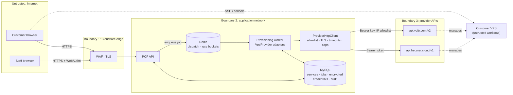

# Threat Model — VPS Provider Integrations: Hetzner Cloud (primary) and Vultr (secondary)

| | |
|---|---|
| Epics | INT-04 Hetzner Cloud/VPS, INT-05 Vultr Compute, SEC-05 Provider credential & integration security, BE-07 service modules |
| Method | STRIDE per element of the data-flow diagram |
| Requirements | VPS-001…012, PRV-001…011, REC-001, SEC-001, SEC-003…006, SEC-012, SEC-013, AUD-004, NFR-005, NFR-014, OPS-009 |
| Standard | OWASP ASVS 5.0 — Level 2; **Level 3** for provider-credential handling (SEC-001) |
| Status | Baseline, written **before** any adapter code. Re-review at Sprint 7 planning (Hetzner) and Sprint 8 planning (Vultr). |

Development of the Hetzner adapter starts against recorded fixtures and a local
fake while the Hetzner account approval is pending. Every adapter PR cites the
threat IDs (`V-xx`) it mitigates and adds the matching tests from §7. A threat
counts as "mitigated" only when its test exists and passes in CI.

---

## 1. Scope

In scope:

- The VPS provider contract and its two adapters (Hetzner Cloud API v1, Vultr API v2).
- Provider credentials: storage, use, scope and rotation.
- Provisioning jobs for VPS services:
  - create, power actions, rebuild, resize
  - snapshots, backups, firewall, reverse DNS (PTR), console
  - cancel/terminate
- Customer and staff actions on VPS services in the portal and admin console.
- Nightly reconciliation of VPS services with each provider.
- Abuse of customer servers, and its effect on our provider accounts.

Out of scope, each with its own threat model:

- identity and sessions (THREAT-MODEL-IDENTITY.md)
- payments and webhooks (Sprint 3)
- the generic job engine internals (Sprint 4)
- staging/production infrastructure that hosts PaxofiCloud itself (`infra/`)

## 2. Assets

| Asset | Why it matters | Classification |
|---|---|---|
| Provider API credentials (Hetzner project tokens, Vultr API keys) | Full control of every customer server in that project/account: read disks via rescue, delete, re-image | Restricted (ASVS L3) |
| Key-encryption key (KEK) for stored credentials | Unlocks every stored credential | Restricted; environment secret only |
| Generated root passwords and console URLs/passwords | Direct root access to a customer server | Restricted; transient |
| Customer SSH public keys | Integrity matters: a swapped key gives an attacker root | Confidential, integrity-critical |
| Service ↔ provider-server mapping (`service_id`, `provider`, `provider_server_id`, label) | Basis of tenant isolation for VPS actions | Integrity-critical |
| Customer server data (disks, snapshots, backups) | Customer content; personal data under NDPA 2023 | Confidential (held by the provider) |
| Provider account standing | Suspension of our account takes every customer server offline | Availability-critical |
| Provider spend | Orphaned or fraudulent servers cost real money | Financial |

## 3. Data-flow diagram and trust boundaries

Trust boundaries:

1. **Internet → edge → API.** These are the same controls as the identity model. Customers never talk to a provider API directly.
2. **API → worker.** The web tier only enqueues jobs. **Only the worker decrypts provider credentials and calls providers.** The web tier has no code path that holds a decrypted token.
3. **Worker → provider.** All calls go through `ProviderHttpClient`, which enforces:
   - https only
   - a per-provider host allowlist (SEC-012)
   - certificate verification on
   - connect/total timeouts and a response size cap
   - no redirects
4. **Provider → customer VPS.** A customer server is an **untrusted workload**. Nothing in PaxofiCloud trusts traffic from customer servers, and they share no network with the application.

## 4. Assumptions

- Provider APIs are authentic when reached over verified TLS at their documented hosts. We do not pin certificates; we pin hostnames.
- Neither provider supports webhooks we rely on. State changes are learned by **polling provider actions** from jobs, never by receiving inbound calls.
- **Hetzner** tokens are scoped to one project, with read or read/write access and no finer permissions. Rate limit: 3,600 requests/hour per project (PRV-010).
- **Vultr** API keys belong to a user whose permissions are set by ACL, and can be restricted to source IPs.
- Payment success ≠ activation. A VPS job runs only after the order is PAID and has passed fraud screening (ORD/PAY state machines).
- Customer servers are run by customers. We are responsible for abuse handling towards the provider, not for what customers run.

## 5. Design decisions this model fixes

Binding for Sprint 7–8. Changing one requires updating this document in the same PR.

| ID | Decision |
|---|---|
| D-1 | **No provider SDKs.** Adapters use our `ProviderHttpClient` and hand-written request/response mappers with strict decoding: unknown enum values map to `UNKNOWN` and then to `NON_RETRYABLE`. This keeps the dependency surface and framework rule intact. |
| D-2 | **One provider contract:** `VpsProvider` exposes `create`, `findByLabel`, `get`, `power`, `rebuild`, `resize`, `snapshot*`, `firewall*`, `setPtr`, `requestConsole`, `delete`, `pollAction`. Hetzner and Vultr implement it, and contract tests run the same suite against both fakes. Product → provider routing is catalogue data, never request data. |
| D-3 | **Dedicated provider projects/accounts per environment** (SEC-006). The production customer project contains **only** customer servers. Our own infrastructure and staging live elsewhere, so a customer-facing mistake cannot touch PaxofiCloud's own hosts and vice versa. |
| D-4 | **Ownership labelling and verification.** Every server is created with label `paxo-svc-{serviceId}` (Hetzner label / Vultr tag) and `paxo-env-{env}`. Before any **destructive** call (rebuild, delete, resize, snapshot restore) the adapter fetches the server and requires that its label equals the service being acted on. On a mismatch it aborts with `NEEDS_ATTENTION` and raises a security alert. |
| D-5 | **Credentials at rest** (SEC-004): XChaCha20-Poly1305 with a KEK from the environment, key ID in the ciphertext, and `provider + environment + credential_id` bound as associated data. Rotation: add new key → re-encrypt → retire old, without downtime. Decrypted tokens live only inside the worker process for one request and are never serialised into jobs, logs, exceptions or queue payloads. |
| D-6 | **Least privilege** (SEC-005). Hetzner: a read/write token for the customer project used only by workers, and a **read-only** token for nightly reconciliation. Vultr: a dedicated API user with only the instance/snapshot/firewall/reverse-DNS permissions (no billing, users or support), its key ACL'd to the production worker egress IP(s) as /32. |
| D-7 | **Idempotent create** (PRV-003). Before `create`, call `findByLabel(paxo-svc-{id})`. If a server exists, adopt it instead of creating a second one. The job stores the provider action ID and resumes polling after a crash. |
| D-8 | **Secrets returned by providers:** generated root passwords (Hetzner `root_password`, Vultr `default_password`) are encrypted (D-5), shown **once** to the owner after re-authentication, then deleted. After 24 h they are deleted even if never viewed. Console credentials (Hetzner `request_console` URL + password) are never persisted: they are returned straight to the owner's authenticated session, expire with the provider's TTL, and are not logged. |
| D-9 | **Customer input is allow-listed, never passed through:** server names `^[a-z0-9-]{1,63}$`; SSH keys parsed and accepted only if `ssh-ed25519` or RSA ≥ 3072 bits (VPS-002); images/plans/locations only from catalogue IDs; firewall rules validated as protocol ∈ {tcp, udp, icmp}, port range 1–65535, valid CIDR, max 20 rules; PTR hostnames must be valid FQDNs **and** forward-resolve to the server IP (VPS-009). **Not offered at MVP:** custom `user_data`, ISO/iPXE URLs, custom images from URLs. These are SSRF-like and malware-delivery vectors on the provider side. |
| D-10 | **Tenant isolation:** the portal addresses servers only by our `service_id`. The provider server ID is loaded from the DB via the tenant-scoped service query (identity D-13) and is never accepted from the client. A foreign service returns 404. |
| D-11 | **Destructive actions** (rebuild, delete, snapshot restore, resize with disk) require step-up authentication within 5 min plus typed confirmation of the server name (VPS-005). Each is audited and triggers an email to the account owner. |
| D-12 | **Abuse posture:** outbound port 25 stays blocked (VPS-012). New accounts are limited to 2 VPS until the account is 30 days old or KYC-verified. Staff "power off and lock" requires a reason and an audit record, and the customer cannot unlock it. An abuse mailbox is monitored with a 24 h response target (OPS-009 runbook). |
| D-13 | **Rate and blast-radius control:** a Redis token bucket per provider project (PRV-010) and a per-account action limit (power actions: 10/min, rebuild: 3/h). The circuit breaker opens per provider (PRV-011). Status pages read cached state refreshed by jobs; they never trigger a live provider call per page view. |
| D-14 | **Termination cleans everything:** deleting a service deletes its server, snapshots, provider backups, firewall attachment and PTR. Reconciliation (REC-001) reports any `paxo-svc-*` resource without an ACTIVE/SUSPENDED service, and any service whose server is missing. |

## 6. Threats (STRIDE)

Ratings: **L** likelihood and **I** impact on a 1–3 scale.

### 6.1 Provider credentials (SEC-003…006)

| ID | STRIDE | Threat | L | I | Mitigation | Req | Test |
|---|---|---|---|---|---|---|---|
| V-01 | I | Database or backup leak exposes provider tokens | 2 | 3 | D-5 encryption with KEK outside DB; AAD binding prevents ciphertext swapping between providers or environments | SEC-004 | `ProviderCredentialEncryptionTest`, `CredentialAadBindingTest` |
| V-02 | I | Token leaks via logs, exception messages or job payloads (e.g. an HTTP error dumping request headers) | 2 | 3 | `ProviderHttpClient` never logs headers or bodies of requests; redaction filter on `Authorization`, `password`, `root_password`, `default_password`, `wss_url`; jobs carry `credential_id`, never the token | AUD-004 | `ProviderLogRedactionTest`, `JobPayloadHasNoSecretsTest` |
| V-03 | E | A stolen token controls more than it needs | 2 | 3 | D-3 separate projects/accounts per environment; D-6 read-only reconciliation token, Vultr ACL + IP allowlist | SEC-005, SEC-006 | Inspection at Sprint 7 gate (checklist in runbook) |
| V-04 | T | Credential can't be rotated quickly after suspected leak | 2 | 3 | Key IDs + `bin/paxoficloud credentials:rotate`; provider token rotation runbook; tokens have a recorded 90-day review date | SEC-004, OPS-009 | `CredentialRotationTest` |
| V-05 | S | Web tier compromised (RCE) reads tokens | 1 | 3 | Trust boundary 2: only workers hold the KEK; web containers do not receive the KEK env var | SEC-004 | `WebTierHasNoKekTest` (config inspection) |

### 6.2 Tenant isolation and integrity of actions (VPS-003…011)

| ID | STRIDE | Threat | L | I | Mitigation | Req | Test |
|---|---|---|---|---|---|---|---|
| V-06 | E | IDOR: customer acts on another customer's server by changing `service_id` | 3 | 3 | D-10 tenant-scoped load, 404 for foreign services; provider IDs never from client | ACC-002 | `VpsTenantIsolationTest` (every VPS route, generated) |
| V-07 | T | Adapter acts on the wrong server (stale mapping, ID reuse, bug) and destroys another customer's data | 1 | 3 | D-4 label verification before destructive calls; mismatch → abort + alert | VPS-005 | `DestructiveActionLabelGuardTest` |
| V-08 | T | Retry after timeout creates duplicate servers (double cost, IP confusion) | 3 | 2 | D-7 find-by-label before create; action ID persisted; worker crash resumes polling | PRV-003 | `IdempotentCreateTest`, `CreateTimeoutThenRetryTest` |
| V-09 | T | Server created at provider but our DB commit fails → orphaned, billed, unmanaged server | 2 | 2 | Label set at create; reconciliation flags unknown `paxo-svc-*`; compensation deletes after operator confirmation | PRV-006, REC-001 | `ReconciliationOrphanDetectionTest` |
| V-10 | E | Stolen session rebuilds/deletes servers | 2 | 3 | D-11 step-up + typed confirmation + owner email | VPS-005 | `VpsDestructiveStepUpTest` |
| V-11 | T | SSH key substitution (attacker adds own key in a request) | 2 | 3 | Keys only from the account's verified key list, added via a step-up action; key fingerprint shown and audited | VPS-002 | `SshKeyValidationTest`, `SshKeyStepUpTest` |
| V-12 | T | Injection into provider requests (names, labels, PTR, firewall descriptions) | 2 | 2 | D-9 allowlists; JSON-encoded bodies only; path parameters are validated integers or catalogue IDs | SEC-012 | `VpsInputValidationTest` |
| V-13 | S | PTR set to a third party's domain (phishing/spam reputation) | 2 | 2 | D-9 forward-confirmed reverse DNS required | VPS-009 | `PtrForwardConfirmationTest` |
| V-14 | I | Console URL/password or root password leaks (logs, browser history, support screenshots) | 2 | 3 | D-8 never persisted (console) / encrypted + shown once + 24 h purge (root password); responses `Cache-Control: no-store` | VPS-010, VPS-002 | `RootPasswordShownOnceTest`, `ConsoleCredentialNotPersistedTest` |
| V-15 | T | MITM or DNS spoofing of provider API | 1 | 3 | TLS verification always on (Semgrep `pc-tls-verification-disabled` blocks regressions); host allowlist; no redirects | SEC-012 | `ProviderHttpClientTlsTest`, `ProviderHttpClientAllowlistTest` |
| V-16 | I | Provider error bodies leak internal IDs or other customers' data to the UI | 1 | 2 | Errors mapped to the PRV-005 taxonomy and generic customer messages; raw body stored redacted for operators only | PRV-005 | `ProviderErrorMappingTest` |

### 6.3 Availability, cost and abuse (PRV-010/011, NFR-014, VPS-012)

| ID | STRIDE | Threat | L | I | Mitigation | Req | Test |
|---|---|---|---|---|---|---|---|
| V-17 | D | One customer (or script) exhausts the shared Hetzner rate limit (3,600/h) → all customers' actions fail | 2 | 2 | D-13 per-account action limits + per-project token bucket; cached status | PRV-010 | `VpsActionRateLimitTest`, `ProviderTokenBucketTest` |
| V-18 | D | Provider outage or slow API blocks workers and the portal | 2 | 2 | Timeouts (NFR-005), circuit breaker per provider, jobs retry with backoff; other products keep working | PRV-004, PRV-011, NFR-014 | `CircuitBreakerTest`, `ProviderTimeoutTest` |
| V-19 | D | Fraudulent orders (stolen cards) spin up many servers → provider bill, abuse | 2 | 3 | Provisioning only after PAID + fraud screen; D-12 new-account VPS limit; provider-side project server limits; daily spend alert | PRV-007, VPS-012 | `NewAccountVpsLimitTest` |
| V-20 | R/D | Customer server used for attacks, spam or mining → provider abuse reports → **our account suspended, all customers offline** | 2 | 3 | D-12 abuse posture; port 25 blocked; AUP accepted at checkout; lock within SLA; Vultr as secondary provider for new orders during a Hetzner incident | VPS-012, NFR-014 | Runbook drill (Sprint 11) |
| V-21 | I | Terminated customer's data remains in snapshots/backups (NDPA retention) | 2 | 2 | D-14 termination cleans all artefacts; reconciliation flags leftovers | REC-001, NDPA 2023 | `TerminationCleanupTest` |

### 6.4 Repudiation and staff actions (AUD, ADM, PRV-009)

| ID | STRIDE | Threat | L | I | Mitigation | Req | Test |
|---|---|---|---|---|---|---|---|
| V-22 | R | Customer disputes that they rebuilt/deleted a server | 2 | 2 | Audit event with actor, session, IP, request ID and provider action ID; owner notification email | AUD-001 | `VpsActionAuditedTest` |
| V-23 | E | Staff misuse: power off, rebuild or read customer servers | 1 | 3 | Staff can only power-off-and-lock (with reason) and retry/skip/cancel jobs (PRV-009); no staff rebuild/delete/console; all audited | PRV-009, VPS-012 | `StaffVpsPermissionTest` |

## 7. Security test plan (Sprints 7–8)

Every test must exist and pass before INT-04 (Hetzner) can close. INT-05 (Vultr) reruns the provider-agnostic tests against its adapter.

| Area | Tests |
|---|---|
| Credentials | `ProviderCredentialEncryptionTest`, `CredentialAadBindingTest`, `CredentialRotationTest`, `ProviderLogRedactionTest`, `JobPayloadHasNoSecretsTest`, `WebTierHasNoKekTest` |
| HTTP client | `ProviderHttpClientTlsTest`, `ProviderHttpClientAllowlistTest`, `ProviderTimeoutTest`, `ProviderErrorMappingTest` |
| Contract (both adapters, against fakes) | `VpsProviderContractTest` (create/poll/power/rebuild/delete/snapshot/firewall/PTR), `IdempotentCreateTest`, `CreateTimeoutThenRetryTest`, `DestructiveActionLabelGuardTest` |
| Portal | `VpsTenantIsolationTest`, `VpsDestructiveStepUpTest`, `SshKeyValidationTest`, `SshKeyStepUpTest`, `VpsInputValidationTest`, `PtrForwardConfirmationTest`, `RootPasswordShownOnceTest`, `ConsoleCredentialNotPersistedTest` |
| Limits | `VpsActionRateLimitTest`, `ProviderTokenBucketTest`, `CircuitBreakerTest`, `NewAccountVpsLimitTest` |
| Lifecycle | `TerminationCleanupTest`, `ReconciliationOrphanDetectionTest` |
| Audit/staff | `VpsActionAuditedTest`, `StaffVpsPermissionTest` |

Contract tests run against recorded fixtures (sanitised: no tokens, real IPs or passwords) in CI. A separate, manually triggered **sandbox smoke** job runs against a dedicated test project once provider accounts are available. It never runs on pull requests from forks, and it never uses production credentials.

## 8. Residual risks

| ID | Risk | Why accepted | Owner | Revisit |
|---|---|---|---|---|
| R-1 | Hetzner tokens cannot be scoped below "project, read/write": a leaked worker token controls all customer servers in production | Provider limitation. Reduced by D-3/D-5/D-6, rotation runbook and monitoring of unexpected provider actions in reconciliation | Engineering | Sprint 7 |
| R-2 | A provider can suspend our whole account over one customer's abuse | Reduced by D-12 and a second provider; not eliminable while we resell | CEO / operations | Sprint 9 |
| R-3 | Provider-side compromise (their control plane) is outside our control | Choice of reputable providers; backups for customers are opt-in (VPS-007) and stored by the same provider | CEO | Annually |
| R-4 | GitHub-hosted/egress IPs for production workers must be stable to use Vultr IP allowlisting | Production workers will run on our own hosts with fixed egress IPs | Engineering | Sprint 8 |

## 9. Open items

| ID | Item | Decision needed by |
|---|---|---|
| O-1 | Hetzner account approval and creation of separate projects: `paxoficloud-dev`, `paxoficloud-staging`, `paxoficloud-prod-customers` | Before Sprint 7 (CEO) |
| O-2 | KYC requirement for VPS beyond 2 servers (D-12): verified phone + ID, or account age only | Sprint 7 planning (CEO) |
| O-3 | Vultr production API user ACL list and egress IPs (R-4) | Sprint 8 planning |
| O-4 | SRS change record: Vultr as secondary VPS provider (provider spec §6, scope §12) | Sprint 1 (CEO signature) |

## 10. Review log

| Date | Change | By |
|---|---|---|
| 2026-10-06 | Baseline created before any VPS adapter code; covers Hetzner (primary) and Vultr (secondary, CEO decision 6 Oct 2026) | Claude (security engineering) |
